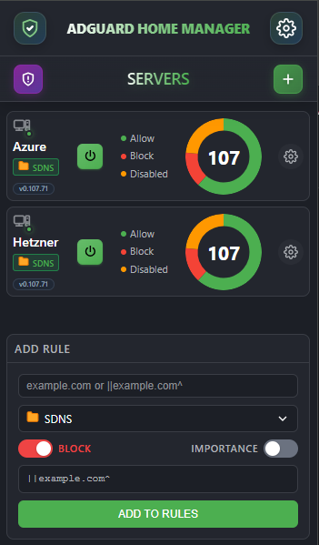
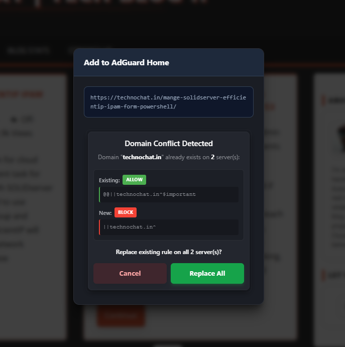

# 🛡️ AdGuard Home Central Manager

> **The ultimate power-tool for managing multiple AdGuard Home instances directly from your release.**

AdGuard Home Central Manager transforms your Chrome browser into a centralized command center. Manage rules, sync settings, and monitor protection status across **unlimited** AdGuard Home servers—without ever leaving your current tab.

---

## ✨ Features at a Glance

| Feature | Description |
| :--- | :--- |
| **Multi-Server Dashboard** | Visual status of all your servers in one compact view. |
| **Group Sync** | Sync rules across `Home`, `Office`, or `Cloud` server groups instantly. |
| **Context Menu** | Block/Allow domains right from the webpage you are browsing. |
| **Smart Encryption** | AES-GCM local encryption for your credentials. Zero cloud data. |
| **Conflict Resolution** | Auto-detects and resolves conflicting rules (Block vs. Allow). |

---

## 🚀 Getting Started

### 1. Adding Your First Server
Connecting is simple and secure.
1.  Click the **Plus (+)** icon on the home screen.
2.  **Server Name**: Enter a friendly name (auto-truncated to a **7-char tag** like `HOME-01`).
3.  **URL**: Full address including protocol (e.g., `http://192.168.1.5` or `https://dns.mysite.com`).
4.  **Credentials**: Enter your AdGuard Home username/password.
5.  **Test Connection**: Verify access before saving.

> **Tip**: If using a self-signed certificate, enable **"Bypass SSL Validation"**.

### 2. The Dashboard
Your mission control center.
-   **Visual Stats**: Donut charts show the ratio of **Allowed** (Green), **Blocked** (Red), and **Disabled** (Orange) rules.
-   **Quick Actions**: Toggle protection ON/OFF or jump to settings with one click.
-   **Status Dots**: Instant Red/Green indicators show if a server is online.

 *Empty state helps you get started quickly.*

---

## �️ Advanced Features

### 📦 Group Management & Sync
Power users often have multiple servers (e.g., Primary & Backup).
1.  Navigate to **Settings** -> **Groups**.
2.  **Create Group**: Name it (e.g., `PROD`) and select your servers.
3.  **Auto-Merge**: The extension intelligently merges rules from all selected servers into a **Master List**.
4.  **One-Click Sync**: Any change to the group effectively updates *all* servers in that group sequentially.

### 🖱️ Context Menu (Web Integration)
Block ads as you see them.
1.  Right-click anywhere on a webpage.
2.  Select **"Add to AdGuard Home"**.
3.  A modal appears *on the page* (no popup needed).
4.  Choose to **Block** or **Allow** the domain.
5.  Select the target **Server** or **Group**.

**Smart Conflict Handling**:
If you try to block a domain that is already allowed, the system warns you immediately. It prioritizes functionality (Allow rules) over blocking to prevent breaking websites.

### 📝 Rule Management
View and manage your custom filtering rules.
-   **Search**: Instantly filter through hundreds of rules.
-   **Syntax Highlighting**: Rules are color-coded (Green for Allow `@@`, Red for Block `||`, Grey for Comments `!`).
-   **Validation**: Invalid rules are rejected before being sent to the server.

---

## 🔒 Security & Privacy Architecture

We built this with a "Trust No One" (even us) philosophy.

### 🛡️ Local-Only Storage
-   **Zero Telemetry**: We do not track your usage, servers, or rules.
-   **Chrome Storage**: All configuration is stored strictly within your browser's `chrome.storage.local` sandbox.

### 🔐 AES-GCM Encryption
Your passwords are **never** stored in plain text.
-   **Algorithm**: AES-GCM (Galois/Counter Mode) - the gold standard for authenticated encryption.
-   **Key Derivation**: A unique 256-bit key is generated using PBKDF2 derived from a device-specific secret.
-   **Isolation**: Even if someone copies your storage file, they cannot decrypt it on another machine.

### 🌐 Direct API Communication
-   The extension talks **directly** to your AdGuard Home instance.
-   No proxy servers, no relay servers, no cloud middleware.
-   Requests use standard `fetch` APIs with sanitized headers.

---

## ⚡ Performance

### Stale-While-Revalidate (SWR)
To ensure the popup opens **instantly** (0ms delay):
1.  **Snapshot Render**: The UI immediately draws the last known state from local cache.
2.  **Background Sync**: A service worker silently fetches fresh data.
3.  **Seamless Update**: If data changed, the UI updates automatically. If not, it stays static.

### Smart Caching
-   Rule lists are cached locally to minimize bandwidth/API load on your servers.
-   Cache validity is managed via `ETag` logic and customizable TTL (Time-To-Live).

---

## 📝 License

This project is licensed under the **MIT License** - see the [LICENSE](LICENSE) file for details.

---

  Built with ❤️ for the AdGuard Community
   
  Not affiliated with AdGuard Software Ltd.

