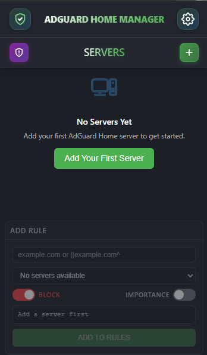
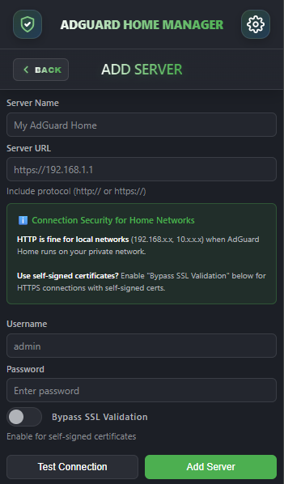
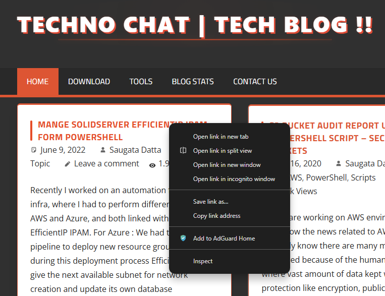

# 🛡️ AdGuard Home Central Manager

> **The ultimate power-tool for managing multiple AdGuard Home instances directly from your Chrome browser.**

AdGuard Home Central Manager transforms your Chrome browser into a centralized command center. Manage rules, sync settings, and monitor protection status across **unlimited** AdGuard Home servers—without ever leaving your current tab.

---

## ✨ Features at a Glance

| Feature | Description |
| :--- | :--- |
| **Multi-Server Dashboard** | Visual status of all your servers in one compact view. |
| **Group Sync** | Sync rules across `Home`, `Office`, or `Cloud` server groups instantly. |
| **Context Menu** | Block/Allow domains right from the webpage you are browsing. |
| **Smart Encryption** | AES-GCM local encryption for your credentials. Zero cloud data. |
| **Conflict Resolution** | Auto-detects and resolves conflicting rules (Block vs. Allow). |

---

## 🚀 Getting Started

### 1. Adding Your First Server
Connecting is simple and secure.
1.  Click the **Plus (+)** icon on the home screen.
2.  **Server Name**: Enter a friendly name (auto-truncated to a **7-char tag** like `HOME-01`).
3.  **URL**: Full address including protocol (e.g., `http://192.168.1.5` or `https://dns.mysite.com`).
4.  **Credentials**: Enter your AdGuard Home username/password.
5.  **Test Connection**: Verify access before saving.

> **Tip**: If using a self-signed certificate, enable **"Bypass SSL Validation"**.

### 2. The Dashboard
Your mission control center.
-   **Visual Stats**: Donut charts show the ratio of **Allowed** (Green), **Blocked** (Red), and **Disabled** (Orange) rules.
-   **Quick Actions**: Toggle protection ON/OFF or jump to settings with one click.
-   **Status Dots**: Instant Red/Green indicators show if a server is online.

---

## ️ Advanced Usage

### 📦 Group Management & Sync
Power users often have multiple servers (e.g., Primary & Backup).
1.  Navigate to **Settings** -> **Groups**.
2.  **Create Group**: Name it (e.g., `PROD`) and select your servers.
3.  **Auto-Merge**: The extension intelligently merges rules from all selected servers into a **Master List**.
4.  **One-Click Sync**: Any change to the group effectively updates *all* servers in that group.

### 🖱️ Context Menu (Web Integration)
Block ads as you see them.
1.  Right-click anywhere on a webpage.
2.  Select **"Add to AdGuard Home"**.
3.  A modal appears *on the page* (no popup needed).
4.  Choose to **Block** or **Allow** the domain.
5.  Select the target **Server** or **Group**.

---

## 🔒 Security & Privacy Architecture

Security is our top priority. We use a military-grade "Trust No One" architecture.

### 🛡️ Local-Only Storage Strategy
-   **Zero Telemetry**: We collect **zero** data. We don't track your IP, your servers, your rules, or your usage patterns.
-   **Sandboxed Storage**: All data is stored exclusively in `chrome.storage.local`. This data never leaves your device unless it is being sent directly to *your* AdGuard Home server.

### 🔐 Multi-Layered Encryption (AES-GCM)
We don't just "scramble" passwords; we encrypt them using the Web Crypto API.

1.  **Device-Specific Secret**: On installation, the extension generates a random 32-byte secret (`_deviceSecret`) unique to your browser installation.
2.  **Key Derivation (PBKDF2)**: We combine this secret with your browser's internal ID and derive a 256-bit encryption key using **PBKDF2** (Password-Based Key Derivation Function 2) with 100,000 iterations.
3.  **AES-GCM Encryption**: Credentials are encrypted using **AES-GCM** (Advanced Encryption Standard in Galois/Counter Mode). This ensures both confidentiality and integrity.
4.  **Unique IVs**: Every encryption operation uses a unique Initialization Vector (IV), ensuring that encrypting the same password twice yields different ciphertexts.

*Result: Even if an attacker copies your raw Chrome storage files, they cannot decrypt your passwords on another machine.*

### 🌐 Direct & Sanitized Communication
-   **No Middleman:** The extension communicates **directly** with your AdGuard Home API endpoints. There are no proxy servers or relay services.
-   **Header Sanitization:** API requests are stripped of potentially leaking headers (like `Referer`) to maintain privacy.
-   **Bypass SSL Option:** We support self-signed certificates for local setups (e.g., `https://192.168.x.x`) by strictly scoping the insecure flag only to your explicit requests.

---

## ⚡ Performance & Caching

AdGuard Home Central Manager is engineered for speed, ensuring 0ms UI latency.

### 🏎️ Stale-While-Revalidate (SWR) Strategy
Traditional extensions show a "Loading..." spinner every time you open them. We don't.
1.  **Instant Render:** As soon as you click the icon, we render the *last known state* from the local cache. The UI appears instantly.
2.  **Silent Update:** In the background, a service worker wakes up and fetches fresh data from your servers.
3.  **Reactivity:** If the server data has changed (e.g., a rule added elsewhere), the UI updates automatically. If not, the background operation finishes silently.

### � Smart Cache Management
To respect your server's resources and your network bandwidth, we implement intelligent caching layers:
-   **Rule Deduplication:** We cache the *content* of your rule lists, not just the raw response. Duplicate rules are stripped before caching, reducing storage size.
-   **Configurable TTL:** You define the "Time-To-Live" for cached data (default: 60 minutes). During this window, we won't hit your server API unless you explicitly click "Refresh".
-   **Prefer Latest Mode:** Critical users can enable "Prefer Latest" in settings to force a fresh network fetch on every interaction, bypassing the cache at the cost of milliseconds.

### 📉 Bandwidth Optimization
-   **Small Payloads:** We only fetch what we need. For server status checks, we use lightweight endpoints.
-   **Sequential Sync:** When syncing a group, updates are processed sequentially (one after another) rather than in parallel chunks. This prevents flooding your server or network with simultaneous requests.

---

## 📝 License

This project is licensed under the **MIT License** - see the [LICENSE](LICENSE) file for details.

---

  Built with ❤️ for the AdGuard Community
   
  Not affiliated with AdGuard Software Ltd.

